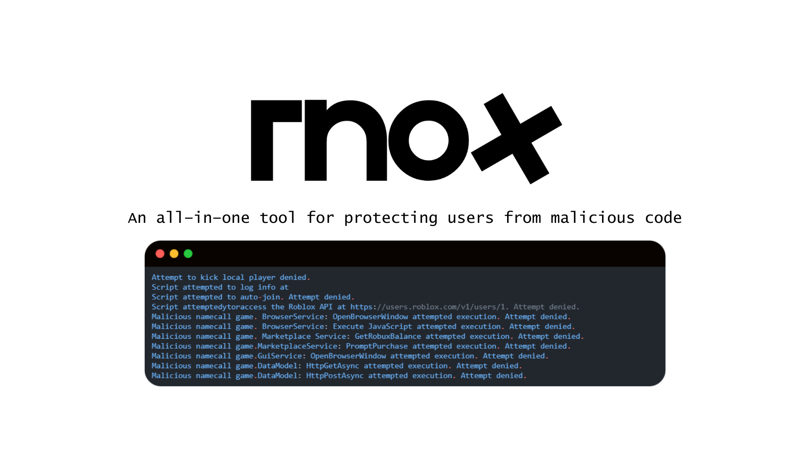

# Rnox
An all-in-one tool for protecting users from malicious code [](https://discord.gg/Q2sd6YEUZc)
```lua
loadstring(game:HttpGet("https://raw.githubusercontent.com/audio-wav/Rnox/main/init.luau"))()
```
> [!CAUTION]
> Rnox will always be *bypassable* due to its nature, bypasses will come and patches will come

> [!NOTE]
> For full documentation, and FAQs, check the wiki: https://github.com/audio-wav/Rnox/wiki

> [!IMPORTANT]
> Contributions are appreciated. There are no rules right now and you can commit to Rnox as much as you want
